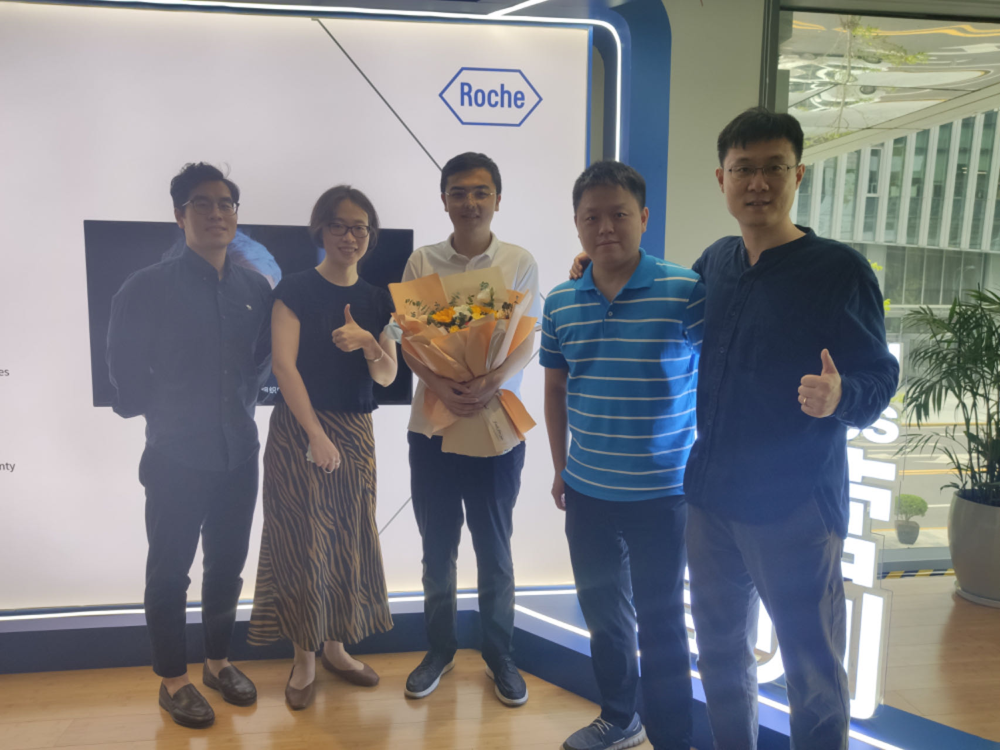

&nbsp;

### Industry

&bull; **Mixed-effect Modeling:** Describing individual time profiles (i.e. trajectories) for a continuous marker ([GitHub](https://github.com/Genentech/jmpost))

&bull; **mySQL Programming:** [Weibo Entertainment White Paper 2021](https://weibo.cn/sinaurl?u=https%3A%2F%2Fv2.rabbitpre.com%2Fm2%2FFw90XhQYdRi) (in Simplified Chinese)

&nbsp;

  
  
  
Biostatistics Intern at Roche Diagnostics, 2022

&nbsp;

### Coursework

&bull; **Exploratory Statistic and Weighted Least Squares Modeling:** Relationship between county population size and COVID-19 prevalence, and the COVID-19 prevalence among different age groups ([Website](https://zhengweisong98.github.io/p8105_final_project/))

&bull; **Linear Modeling:** Body fat based on physiological indicators ([Report](projects/linear reg.pdf))

&bull; **Statistical Learning:** Prediction models for Covid-19 recovery time and risk factors for long recovery time ([Report](projects/statistical learning.pdf))

&bull; **Monte Carlo Simulation:** Designing a simulation study to assess the three hypothesis testings of log-rank test ([Report](projects/MC simulation report.pdf), [Slide](projects/MC simulation.pdf))

&bull; **Newton-Raphson Algorithm:** Analyses of daily COVID-19 cases, hospitalization, death in NYC ([Report](projects/Newton report_self.pdf), [Slide](projects/Newton_self.pdf))

&bull; **MCMC:** Bayesian Hierarchical Modeling of COVID-19 Cases and Government Response in the US ([Report](projects/MCMC report.pdf), [Slide](projects/MCMC_self.pdf))

&bull; **MLMC:** Black-Scholes Pricing Model Data Simulation by Multilevel Monte-Carlo Method ([Slide](projects/mlmc.pdf))

# Extracurricular Activities

&bull; Edible Tableware based on Finite Element Analysis. Shandong University School of Mathematics - Enactus Joint Undergraduate Program on Edible Tableware Innovation ([Report](projects/edible tableware result.pdf))

&nbsp;

{width=50%}

&nbsp;
