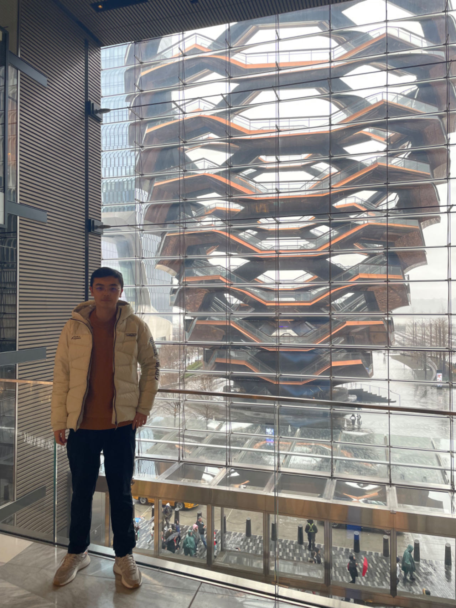
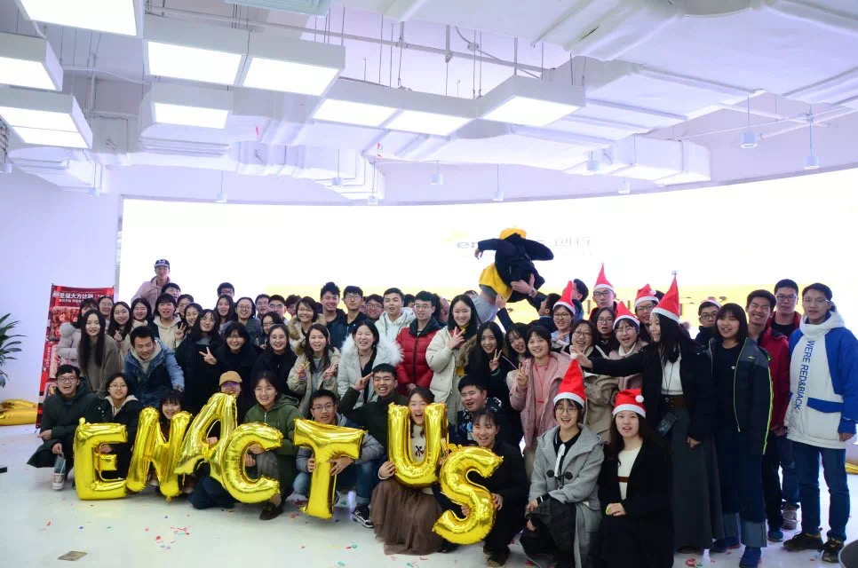

&nbsp;

&nbsp;

# Hello!

I am a master student in biostatistics, interested in biomedical applications of data science and statistics. My [CV](CV/CV_Jun2023.pdf), LinkedIn and GitHub homepage are in the top right-hand corner, also, you may see the email address and phone number at bottom.

# Key Projects

### Industry

&bull; Mixed-effect Modeling (Describing individual time profiles (i.e. trajectories) for a continuous marker): [GitHub](https://github.com/Genentech/jmpost)

&bull; mySQL Programming (Weibo Entertainment White Paper 2021): [White Paper](https://weibo.cn/sinaurl?u=https%3A%2F%2Fv2.rabbitpre.com%2Fm2%2FFw90XhQYdRi) (in Simplified Chinese)

&nbsp;

{width=50%}

&nbsp;

### Coursework

&bull; Exploratory Statistic and Weighted Least Squares Modeling (Relationship between county population size and COVID-19 prevalence, and the COVID-19 prevalence among different age groups): [Website](https://zhengweisong98.github.io/p8105_final_project/)

&bull; Linear Modeling (Body fat based on physiological indicators): [Report](projects/linear reg.pdf)

&bull; Statistical Learning (Prediction models for Covid-19 recovery time and risk factors for long recovery time): [Report](projects/statistical learning.pdf)

&bull; Monte Carlo Simulation (Designing a simulation study to assess the three hypothesis testings of log-rank test ): [Report](projects/MC simulation report.pdf), [Slide](projects/MC simulation.pdf)

&bull; Newton-Raphson Algorithm (Analyses of daily COVID-19 cases, hospitalization, death in NYC): [Report](projects/Newton report.pdf), [Slide](projects/Newton.pdf)

&bull; MCMC (Bayesian Hierarchical Modeling of COVID-19 Cases and Government Response in the US): [Report](projects/MCMC report.pdf), [Slide](projects/MCMC.pdf)

&bull; MLMC (Black-Scholes Pricing Model Data Simulation): [Slide](projects/mlmc.pdf)

# Extracurricular Activities

&bull; Edible Tableware Undergraduate Project: [Report](projects/edible tableware result.pdf)

{width=50%}

# Contact

<i class="fas fa-phone"></i> Tel: +1 (332)-256-6895

<i class="fas fa-envelope"></i> Email: <zs2539@cumc.columbia.edu>

<i class="fa-solid fa-map-location-dot"></i> Address: 630 W 168th St, Presbyterian Hospital 19F, New York, NY, 10032