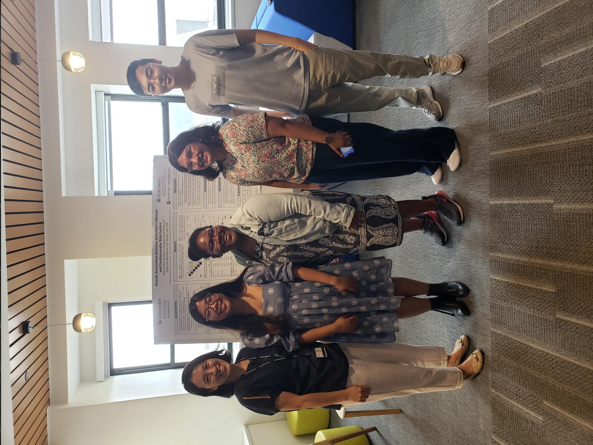

&nbsp;

### TEACHING

Spring 2024: Teaching Assistant, “Data Science II” (P8106), Department of Biostatistics, Columbia University. Instructor: [Dr. Yifei Sun](https://www.publichealth.columbia.edu/profile/yifei-sun-phd)

*With the explosion of “Big Data” problems, statistical learning has become a very hot field in many scientific areas. The goal of this course is to provide the training in practical statistical learning. It is targeted to MS students with some data analysis experience.*

Fall 2023: Teaching Assistant, “Biostatistical Methods I” (P8130), Department of Biostatistics, Columbia University. Instructor: [Dr. Molei Liu](https://moleibobliu.github.io/)

*This one-semester course introduces basic applied descriptive and inferential statistics. The first part of the course includes elementary probability theory, an introduction to statistical distributions, principles of estimation and hypothesis testing, methods for comparison of discrete and continuous data including chi-squared test of independence, t-test, analysis of variance (ANOVA), and their non-parametric equivalents. The second part of the course focuses on linear models (regression) theory and their practical implementation.*

Fall 2023: Teaching Assistant, “Introduction to Mathematical Statistics” (P8107), Department of Biostatistics, Columbia University. Instructor: [Dr. R. Todd Ogden](https://www.publichealth.columbia.edu/profile/r-todd-ogden-phd)

*The first portion of this course provides an introductory-level mathematical treatment of the fundamental principles of probability theory, providing the foundations for statistical inference. Students will learn how to apply these principles to solve a range of applications. The second portion of this course provides a mathematical treatment of (a) point estimation, including evaluation of estimators and methods of estimation; (b) interval estimation; and (c) hypothesis testing, including power calculations and likelihood ratio testing.*

### MENTORSHIP

Summer 2023: 

&emsp; Mentoring, Danielle Savellano, Sophomore in Biology, Allegheny College

&emsp; Mentoring, Kayla Scott-McDowell, Junior in Biochemistry & Sociology, Mt. Holyoke College

&emsp; Mentoring two undergraduate students on "[Genetic Association Between Alzheimer’s Disease and Cardiovascular Risk Factors](teaching/BEST_poster.pdf)" from [Biostatistics Epidemiology Summer Training (BEST) Diversity Program](https://www.publichealth.columbia.edu/research/programs/biostatistics-epidemiology-summer-training/about) belonging to Summer Health Professions Education Program (SHPEP), Columbia University. Advisor: [Dr. Annie Lee](https://blogs.cuit.columbia.edu/ajl2199/)

&nbsp;

  
  
BEST, 2023

&nbsp;